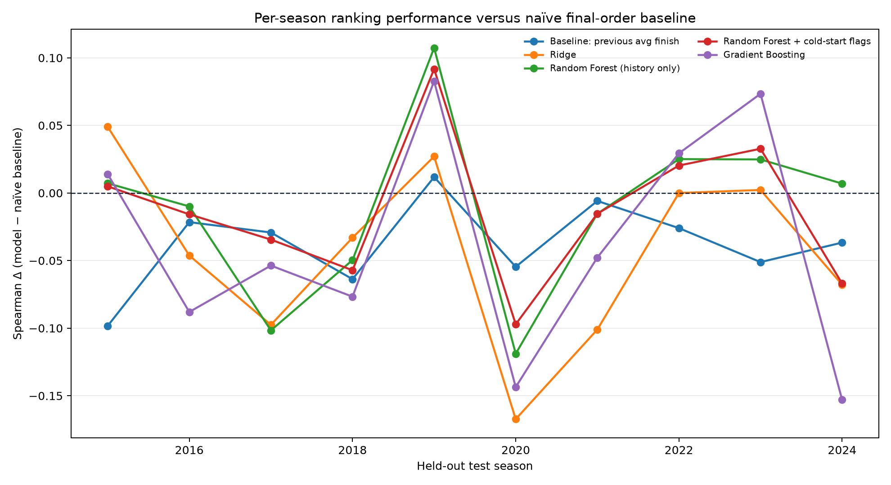

# F1 Championship Forecasting

[](https://github.com/icecold009/f1-championship-prediction/actions/workflows/ci.yml)
[](https://www.python.org/)
[](LICENSE)

A leakage-safe study of whether historical driver and constructor performance can
forecast the final Formula 1 Drivers’ Championship order.

## Executive finding

The strongest result is a negative one: a naïve “repeat last season’s order”
baseline remains stronger overall than the fitted models. Across ten untouched
future seasons (2015–2024), the baseline reaches mean Spearman ρ **0.821**,
compared with **0.808** for the history-only Random Forest and **0.807** after
adding cold-start flags. The history-only forest wins five seasons and loses
five, but its paired 95% interval for mean Spearman improvement spans
**−0.051 to +0.026**. On RMSE, it loses nine of ten seasons.

That makes this project an exercise in trustworthy forecasting rather than an
algorithm leaderboard: every season is held out intact, uncertainty is
backtested, failure modes are segmented, and the exact raw snapshot is
identified by checksums.

**[Open the validated example report](docs/index.html)**
The report contains the forecast, baseline comparison, uncertainty calibration,
error analysis, and held-out permutation importance.

## Project Overview

This project focuses on:

- Collecting and cleaning **historical F1 data** (drivers, constructors, races, results)
- Engineering features that represent prior-season driver performance, constructor strength, qualifying pace, and reliability
- Training machine learning models to:
  - Predict **final championship position**
  - Predict **final position / tier** (e.g. champion, podium contender, midfield, backmarker)
- Evaluating how well we can **forecast a season's final standings** without using that season's race outcomes as predictors.

## Quickstart

```bash
# 1. Clone and install
git clone https://github.com/icecold009/f1-championship-prediction.git
cd f1-championship-prediction
python -m venv .venv
# Windows: .venv\Scripts\activate
# macOS/Linux: source .venv/bin/activate
pip install -r requirements.txt

# 2. Download the raw CSV inputs (kept out of Git)
python scripts/download_data.py

# 3. Run processing, training, prediction, visualisation, and HTML report
python main.py --year 2023 --report

# 4. Re-run the auditable rolling-origin evaluation independently
python scripts/evaluate.py

# 5. Run the slower calibration and interpretation audit
python scripts/model_audit.py
```

Predictions are saved to `results/2023_predictions.csv`; the chart and user-facing report are saved to
`results/predicted_vs_actual_2023.png` and `results/f1_prediction_report_2023.html`. Processed data
and result files are regenerated locally and ignored by Git. The evaluation command writes summary
and per-season detail CSVs under `results/`. See [MODEL_CARD.md](MODEL_CARD.md) for intended use,
limitations, and the evaluation protocol.

For a validated release bundle with provenance metadata, run
`python scripts/build_release.py --download --year 2023`. See [RELEASE.md](RELEASE.md) for the
local checklist and the manual GitHub Actions artifact workflow.

## Tests

Run the unit tests locally with:

```bash
pip install -r requirements-dev.txt
python -m ruff check .
python -m ruff format --check .
python -m pytest -q --cov --cov-report=term-missing
```

The same lint, format, test, and coverage gates run in GitHub Actions for
Python 3.12 and 3.13.

## Problem Framing

There is one primary prediction task and one derived reporting task:

1. **Regression task**  
   Predict the **final championship position** for each driver. The numeric
   output is a predicted position, not predicted championship points.

2. **Ranking / classification task**  
   Predict a driver’s **final standing (or tier)**, for example:
   - World Champion  
   - Top 3  
   - Top 5 / Top 10  
   - Midfield  
   - Backmarker  

The final output is a **predicted ordered list of drivers**, which can be compared to the actual final standings.

## Data

The dataset includes (per season and per driver):

- Driver information (name, team, nationality, experience)  
- Constructor / team information  
- Race-by-race results:
  - Finishing position  
  - Points scored  
  - Grid position  
  - DNFs / DNS  
- Historical season-level aggregates:
  - Total races started  
  - Average finish position  
  - Average grid position  
  - Points per race  
  - Podiums, wins, poles, fastest laps  

The raw CSVs are downloaded from the public [Formula 1 Race Data Kaggle dataset](https://www.kaggle.com/datasets/jtrotman/formula-1-race-data), which uses the Ergast-compatible table layout expected by this project. The local snapshot used for the reported results has a project-recorded pull date of **2025-01-29** and contains seasons through **2024**. `data/raw/data_manifest.json` stores the SHA-256 digest and byte size of every input table; `results/release_manifest.json` carries those identifiers into every validated build. If the original archive metadata is unavailable, the manifest says so instead of inventing provenance.

Ergast’s public API was retired after the 2024 season; the linked Kaggle dataset
preserves the compatible table structure. Running
`python scripts/download_data.py` fetches a new snapshot, validates required
columns, and records the archive digest and response metadata when available.

The project uses this dataset as its raw-data source; the local `data/raw/` files are generated inputs and are intentionally not tracked.

## Features & Approach

Key feature engineering ideas. All predictors are available before the target
season's championship outcome is known:

### Performance metrics

- Prior-season average finish position
- Prior-season average grid position
- Prior-season grid-to-finish delta (racecraft)
- Prior-season win / podium / points-scoring rates

### Reliability

- Prior-season number and percentage of DNFs
- Prior-season races started

### Team strength

- Prior constructor championship points
- Prior constructor championship position

The current season's race results are not used as predictors. The season-opening
constructor is used to join its prior final championship strength, while the
final driver standings are retained only as evaluation targets.

## Model Results

Every reported metric uses the same leak-free walk-forward protocol. For each
test season **N+1**, the model is trained on all available seasons through **N**;
all rows from the test season remain together and never appear in training.
The reported values are the mean and standard deviation across ten chronological
test seasons, 2015–2024. RMSE measures position error, R² measures explained
position variance, and Spearman ρ measures agreement in predicted order.

The primary naïve baseline is **previous-season final order**: rank the current
season's entrants by their prior-season championship points, assigning drivers
without prior history zero points. It uses no fitted model and represents the
simple pre-season guess that last season's order will persist. The delta column
is each row's Spearman ρ minus that naïve baseline on the same test season.

| Model / baseline | Test seasons | Mean RMSE | RMSE SD | Mean R² | R² SD | Mean Spearman ρ | Spearman SD | Mean Δ vs naïve | Δ SD |
|---|---:|---:|---:|---:|---:|---:|---:|---:|---:|
| Naive: previous-season final order | 10 | 3.758 | 0.747 | 0.641 | 0.161 | 0.821 | 0.081 | 0.000 | 0.000 |
| Random Forest (history only) | 10 | 6.657 | 2.818 | -0.277 | 1.042 | 0.808 | 0.061 | -0.012 | 0.065 |
| Random Forest + cold-start flags | 10 | 6.531 | 2.704 | -0.217 | 0.998 | 0.807 | 0.051 | -0.014 | 0.055 |
| Gradient Boosting | 10 | 6.938 | 2.630 | -0.346 | 1.028 | 0.784 | 0.058 | -0.036 | 0.084 |
| Baseline: previous avg finish | 10 | 4.564 | 0.875 | 0.462 | 0.273 | 0.783 | 0.085 | -0.038 | 0.031 |
| Ridge | 10 | 9.517 | 2.178 | -1.359 | 1.235 | 0.777 | 0.057 | -0.043 | 0.066 |

The naïve previous-season-order baseline remains stronger than every machine
learning regressor in this walk-forward evaluation. The cold-start flags reduce
Random Forest RMSE by **0.126 positions** but do not improve mean rank
correlation. That mixed ablation result is retained rather than presenting the
new features as a blanket improvement.

### Paired evidence against the naïve baseline

The confidence intervals below resample whole test seasons, preserving the
paired comparison. A Spearman win means the method has higher rank correlation
than the naïve baseline in that season; an RMSE win means lower error.

| Method | Mean Spearman Δ | Paired 95% CI | Spearman W–L | Mean RMSE Δ | RMSE W–L |
|---|---:|---:|---:|---:|---:|
| Random Forest (history only) | -0.012 | [-0.051, 0.026] | 5–5 | +2.898 | 1–9 |
| Random Forest + cold-start flags | -0.014 | [-0.045, 0.019] | 4–6 | +2.773 | 1–9 |
| Gradient Boosting | -0.036 | [-0.086, 0.013] | 4–6 | +3.179 | 0–10 |
| Previous average finish | -0.038 | [-0.056, -0.020] | 1–9 | +0.806 | 0–10 |
| Ridge | -0.043 | [-0.083, -0.006] | 3–6, 1 tie | +5.759 | 0–10 |



### Tier classification

The tier classifier is also retrained before each test season. Accuracy is the
fraction of correctly classified drivers, while macro F1 gives each tier equal
weight. The previous ambiguous “CV Accuracy” value has been removed; these are
walk-forward test-season metrics only. The mean macro F1 headline is **0.441**,
but it should not be read as uniform usefulness across tiers. Podium F1 **0.174**
and Top 5 F1 **0.207** are close to unusable for individual driver
classification. This is a 200-tree Random Forest with `max_depth=8`, trained on
`FEATURE_COLUMNS` from `src/model.py`; the weak results likely reflect class
imbalance across the six tiers and/or overlapping feature distributions between
adjacent tiers. Champion F1 **0.800** and Backmarker F1 **0.681** are the tiers
where the classifier is genuinely useful for individual driver classification.

| Model | Test seasons | Mean accuracy | Accuracy SD | Mean macro F1 | Macro F1 SD |
|---|---:|---:|---:|---:|---:|
| Random Forest | 10 | 0.509 | 0.072 | 0.441 | 0.073 |

| Tier | Test seasons | Mean F1 | F1 SD |
|---|---:|---:|---:|
| Champion | 10 | 0.800 | 0.322 |
| Podium | 10 | 0.174 | 0.283 |
| Top 5 | 10 | 0.207 | 0.274 |
| Top 10 | 10 | 0.511 | 0.143 |
| Midfield | 10 | 0.271 | 0.193 |
| Backmarker | 10 | 0.681 | 0.120 |

The complete per-season values are regenerated by `python scripts/evaluate.py`;
the training cutoff for every row is retained in
`results/rolling_origin_summary_details.csv` and
`results/tier_rolling_origin_summary_details.csv`.

### Prediction uncertainty

The user-facing forecast also fits **100 season-level bootstrap Random Forests**
using only seasons before the forecast year. For every driver,
`results/2023_predictions.csv` and the HTML report include:

- `Champion Probability`, `Top 3 Probability`, and `Top 5 Probability`: the
  fraction of bootstrap rankings placing that driver in each outcome set.
- `Bootstrap Position P05` and `Bootstrap Position P95`: the central 90%
  interval of predicted positions.
- `Bootstrap Position SD`: the spread of predicted positions.

These are empirical model-uncertainty estimates, not calibrated betting odds or
guaranteed real-world probabilities. The full per-driver distribution summary is
shown in the generated report; the number of bootstrap runs is recorded in the
prediction CSV.

#### Historical calibration audit

The uncertainty method is also backtested on the same ten untouched seasons.
The result is cautionary:

| Measure | Result |
|---|---:|
| Driver-season observations | 223 |
| Bootstrap P05–P95 coverage | 0.323 |
| Bootstrap mean interval width | 4.920 positions |
| Rolling conformal coverage | 0.964 |
| Rolling conformal mean width | 19.680 positions |
| Top-3 Brier score | 0.068 |
| Champion Brier score | 0.019 |

The bootstrap intervals are much too narrow to be interpreted as 90% prediction
intervals. Rolling conformal intervals recover coverage using only residuals
available before each test season, but their width makes them weakly informative.
The highest top-three probability bin is also overconfident: mean predicted
probability **0.954** versus an observed top-three rate of **0.773** across 22
driver-seasons. These findings are why the report labels bootstrap outputs as
model-sensitivity frequencies rather than calibrated real-world odds.

For the regenerated 2023 artifact, the leading point-forecast rows are:

| Driver | Point rank | Champion | Top 3 | Position P05–P95 |
|---|---:|---:|---:|---:|
| Max Verstappen | 1 | 98% | 100% | 1.88–3.75 |
| Carlos Sainz | 2 | 0% | 45% | 3.92–7.16 |
| Charles Leclerc | 3 | 2% | 63% | 3.56–7.00 |
| Sergio Pérez | 4 | 0% | 64% | 3.91–6.32 |

The CSV and HTML report include the same uncertainty fields for every driver.

---

## Where this model breaks

This section uses the same leak-free Random Forest walk-forward predictions and
adds post-hoc diagnostic labels. A positive signed error means the model placed
a driver lower than their actual final position. The labels are not predictors.

### Driver and season type

| Diagnostic group | Observations | RMSE | MAE | Mean signed error |
|---|---:|---:|---:|---:|
| Returning | 179 | 4.718 | 3.198 | 0.618 |
| Rookie | 33 | 11.264 | 8.571 | 5.506 |
| Returning after gap | 11 | 15.851 | 12.443 | 10.480 |
| No mid-season swap | 216 | 7.019 | 4.418 | 1.835 |
| Mid-season swap | 7 | 6.478 | 5.416 | 1.607 |
| Other test seasons | 201 | 7.172 | 4.486 | 1.839 |
| 2022 regulation-change season | 22 | 5.209 | 4.117 | 1.723 |

The clearest failure mode is missing history: returning drivers after a gap have
**12.443 MAE**, while ordinary returning drivers have **3.198 MAE**. Rookies
also have much larger error (**8.571 MAE**) than established returners. Mid-season
swaps are slightly worse than non-swaps, but the sample is only seven driver-
seasons, so that result is not conclusive.

### Worst chronological test seasons

| Test season | Train through | RMSE | MAE | Spearman ρ |
|---:|---:|---:|---:|---:|
| 2015 | 2014 | 11.414 | 7.697 | 0.726 |
| 2016 | 2015 | 10.221 | 5.893 | 0.861 |
| 2019 | 2018 | 7.957 | 5.683 | 0.744 |
| 2020 | 2019 | 5.005 | 4.193 | 0.776 |
| 2022 | 2021 | 5.209 | 4.117 | 0.843 |

The 2022 regulation-change case is a useful stress test, but it is not the
worst season by MAE in this sample. That is the honest conclusion: the model
shows a positive **1.723** mean signed error in 2022, but the largest failures
are concentrated in earlier seasons and in drivers with weak or missing history.

The underlying per-driver errors, season summaries, and group summaries are
regenerated by `python scripts/error_analysis.py` into
`results/error_analysis_driver.csv`,
`results/error_analysis_season_summary.csv`, and
`results/error_analysis_group_summary.csv`.

---

## Held-out permutation importance

Training-set impurity importance has been replaced with permutation importance
measured separately on every untouched future season. Values are the mean
increase in held-out RMSE after shuffling one feature; larger positive values
indicate more useful out-of-season information.

| Rank | Feature | Mean RMSE increase | Season SD | Positive seasons |
|---|---|---:|---:|---:|
| 1 | prev_season_points_sum | 4.063 | 1.345 | 10/10 |
| 2 | prev_team_final_position | 2.534 | 1.435 | 10/10 |
| 3 | prev_team_final_points | 1.259 | 1.438 | 9/10 |
| 4 | prev_season_races_started | 1.125 | 1.729 | 8/10 |
| 5 | prev_season_avg_finish_pos | 0.943 | 0.667 | 10/10 |
| 6 | prev_season_avg_grid_pos | 0.571 | 0.229 | 10/10 |
| 7 | missing_constructor_history | 0.400 | 0.485 | 8/10 |
| 8 | prev_season_podium_rate | 0.189 | 0.095 | 10/10 |
| 9 | returning_after_gap | 0.082 | 0.135 | 7/10 |
| 10 | prev_season_win_rate | 0.041 | 0.026 | 9/10 |

## Next steps

- Replace the season-opening-constructor approximation with an explicit pre-season entry list, as `MODEL_CARD.md` notes that the historical reconstruction currently takes the first constructor observed in race data.
- Investigate leakage-safe prior-season aggregates from the qualifying and pit-stop tables that `create_features()` currently loads and discards with `del qualifying, pit_stops`.
- Add per-season confusion matrices and class-support counts for all six tiers before changing the classifier, because Podium F1 **0.174** and Top 5 F1 **0.207** are close to unusable and do not show whether imbalance or adjacent-tier overlap dominates.
- Treat rookies and returning-after-gap drivers as a separate cold-start evaluation slice, because missing prior-season values are imputed with zero and those groups have the largest observed MAE (**8.571** and **12.443**).
- Keep the previous-season-order baseline as a model-selection gate for future changes, because it still beats every fitted regressor overall and the Random Forest loses nine of ten seasons on RMSE.

## Tech Stack

- **Language:** Python 3.12–3.13
- **Data:** CSV files (`pandas` DataFrames)  
- **Core libraries:**
  - `pandas`, `numpy`  
  - `scikit-learn`  
  - `matplotlib`, `seaborn` (visualization)  
- **Quality gates:** `pytest`, branch coverage, Ruff lint/format, GitHub Actions
