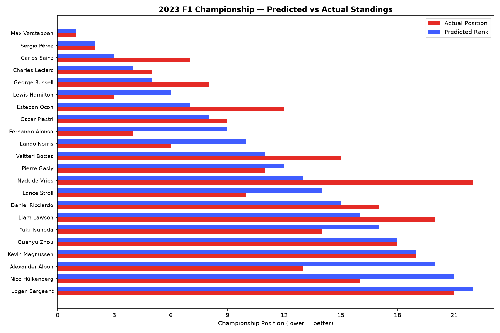

# F1 Championship Forecasting

[](https://github.com/icecold009/f1-championship-prediction/actions/workflows/ci.yml)
[](https://www.python.org/)
[](LICENSE)

A leakage-safe study of how well historical driver and constructor performance can forecast the Formula 1 Drivers’ Championship. It compares machine-learning models with a simple previous-season baseline using full-season, chronological backtests.

**The central finding is clear:** the previous-season-order baseline currently outperforms every fitted regressor overall. The project makes that result—and the limits of its forecasts—easy to inspect and reproduce.

**[View the validated 2023 report](docs/index.html)** · [Model card](MODEL_CARD.md) · [Release guide](RELEASE.md) · [Case study](showcase/f1-championship-prediction/case-study.md)



## Results at a glance

Mean results across ten untouched test seasons (2016–2025):

| Method | Mean RMSE ↓ | Mean Spearman ρ ↑ |
|---|---:|---:|
| Previous-season final order baseline | **3.728** | **0.821** |
| Random Forest with cold-start flags | 5.982 | 0.811 |
| Gradient Boosting | 6.302 | 0.757 |

The history-only Random Forest improves on the baseline’s Spearman rank correlation in four of ten seasons and has a paired 95% season-bootstrap interval of **−0.057 to +0.029** for the mean difference. It has higher RMSE in eight seasons. The evidence does not support claiming that the fitted models are more accurate than the simple baseline.


The experimental tier classifier has mean macro F1 **0.414**. Results vary sharply by tier: Podium F1 is **0.183** and Top 5 F1 is **0.217**. Bootstrap position intervals also under-cover in historical backtests, so bootstrap frequencies are model-sensitivity measures—not calibrated probabilities, betting odds, or guarantees.

## What the project does

- Builds pre-season features from prior driver and constructor performance, including finishing and grid positions, points, podiums, wins, and reliability.
- Predicts driver championship positions and derived standing tiers.
- Compares fitted models with previous-season order and other simple baselines.
- Evaluates uncertainty, calibration, feature importance, and error patterns on held-out seasons.
- Produces local CSV predictions, charts, and an HTML report tied to the source-data snapshot.

Current-season race outcomes are excluded from predictors. Each historical test season is held out in full; training uses only earlier seasons. The project uses the public [Formula 1 Race Data dataset](https://www.kaggle.com/datasets/jtrotman/formula-1-race-data) in Ergast-compatible CSV format. Raw files are downloaded locally and are not committed. Data and release manifests record checksums and provenance for reproducibility.

## Quickstart

Requires Python 3.12 or 3.13.

```bash
git clone https://github.com/icecold009/f1-championship-prediction.git
cd f1-championship-prediction
python -m venv .venv
```

Activate the environment (`.venv\Scripts\activate` on Windows, or `source .venv/bin/activate` on macOS/Linux), then install dependencies and fetch the raw data:

```bash
python -m pip install -r requirements.txt
python scripts/download_data.py
```

Generate a forecast and HTML report, then independently rerun the historical evaluation:

```bash
python main.py --year 2023 --report
python scripts/evaluate.py
```

Predictions and generated reports are written under `results/` and are ignored by Git. To build and validate a local release bundle, see [RELEASE.md](RELEASE.md).

## Verification

Install the development dependencies and run the same checks used by GitHub Actions:

```bash
python -m pip install -r requirements-dev.txt
python -m ruff check .
python -m ruff format --check .
python -m pytest -q --cov --cov-report=term-missing
```

CI runs these checks on Python 3.12 and 3.13. The historical model audit is a separate, slower release step described in the [release guide](RELEASE.md).

## Scope and limitations

This is an educational, research-oriented forecasting project—not a live race prediction service or a decision tool for betting, finance, employment, or safety-critical use. Historical entrant and constructor information is reconstructed from race data; for historical seasons, the season-opening constructor is approximated by the first constructor observed in that season. New regulations, rookies, and drivers returning after a break can be difficult to forecast, and the uncertainty estimates are not calibrated for real-world odds.

For the full evaluation protocol, per-season metrics, calibration results, failure analysis, intended use, and known limitations, see the [model card](MODEL_CARD.md). For reproducible local builds and artifact validation, see the [release guide](RELEASE.md).

## License

Released under the [MIT License](LICENSE).
